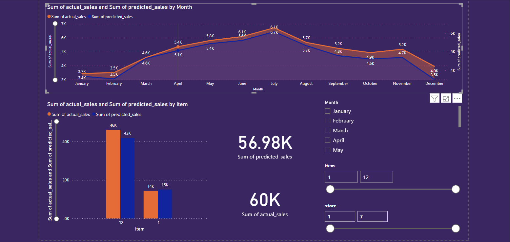

# Sales Forecast Dashboard

An interactive data project that combines Jupyter Notebook analysis and a Power BI dashboard to predict retail sales and compare them with actual results. This repository includes Python code, datasets, and a Power BI file to visualize the output effectively.

---

## Project Components

### Notebooks
- `code.ipynb`: Core data preprocessing, model training, and forecasting logic.
- `code2.ipynb`: Additional or exploratory analysis for refinement and insights.

### Data Files
- `sales_forecast_output.csv`: Output of the model — predicted sales.
- `sales_forecast_with_categories.csv`: Dataset enriched with product category and other relevant features.

### Visualization
- `Sales Forecasting for a Retail Store.pbix`: Power BI dashboard showing:
  - Predicted vs Actual Sales
  - Store-level and item-level insights
  - Time-series breakdown
- `dashboard.png`: Preview snapshot of the Power BI dashboard.

---

## How to Use

1. **Jupyter Notebooks**  
   Run `code.ipynb` and `code2.ipynb` to perform data analysis and generate forecasts using Python.

2. **Power BI**  
   Open the `.pbix` file with [Power BI Desktop](https://powerbi.microsoft.com/) to interact with the visual dashboard.

---

## Dependencies

### Python (used in Jupyter notebooks):
- pandas
- numpy
- sklearn
- matplotlib
- seaborn

> Use `pip install -r requirements.txt` if you extract dependencies into a `requirements.txt`.

---

## Dashboard Preview

---

## License

This project is open-source and available under the [MIT License](LICENSE).

---

## Author

**Dhairyashil112041**  
If you like this project, feel free to star it or reach out!

